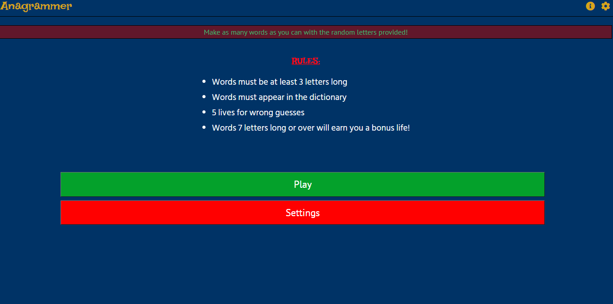

<h1 align="center">Anagrammer</h1>

[View the live project here.](https://michaelcwalsh7.github.io/Milestone-Project-2/)

This is a web application game that tests the user's vocabulary by asking them to make 
words from a random selection of letters.

<h2 align="center">

## User Experience (UX)

-   ### User stories

    -   #### First Time Visitor Goals
        1. As a First Time Visitor, I want to be able to easily understand the purpose of the site and understand the rules
         of the game.
        2. As a First Time Visitor, I want to be able to easily navigate through the site, find and interact with the content available.
        3. As a First Time Visitor, I want to play the game quickly, and with minimal effort.
        4. As a First Time Visitor, I want to be able to easily tell if I have succeeded or failed at the goal of the game. 
        5. As a First Time Visitor, I want to be able to adjust or mute the volume of the game as I so choose. 
        6. As a First Time Visitor, I want to control exactly when the game/timer starts, so I'm not unduly thrust into a game
        experience that I'm not prepared for. 
        7. As a First Time visitor I want to clear track my progress through the game.

    -   #### Returning Visitor Goals

        1. As a Returning Visitor, I want to understand further nuances in the game.
        2. As a Returning Visitor, I want to change the difficulty to test my skills at the game. 
        3. As a Returning Visitor, I want to contact the user with any questions or queries that I may have with the 
        information provided.
        4. As a Returning Visitor, I want to be able to play the game using my keyboard as well the letter buttons provided.
    -   #### Frequent User Goals
        1. As a Frequent User, I want to easily check to see if there are any newly added game modes or challenges.
        2. As a Frequent User, I want to test my skill by trying longer words at harder difficulties.
        3. As a Frequent User, I want to reset the game at any time, if I win, lose or am in the middle of a game.  


*   ### Design

    -   #### Colour Scheme
        - The two main colours used for the game's theme are midnight blue (sometimes called dark midnight blue) for the 
        background and a light yellowish/orange colour that pairs with it quite nicely for other elements. They have a muted,
        yet playful tone that is appropriate for this type of word game.
        -   The midnight blue colour was the first one that was conceptualised drawing inspiration from the popular television
        show [Countdown](https://en.wikipedia.org/wiki/Countdown_(game_show)), which predominantly uses a very similar colour.
        -  The muted tone of the two main colours contrasts nicely with the bright red and green colours used for several 
        other elements throughout the game. Bright reds and greens are used functionally here, rather than stylistically. 
        Most users of any application will be familiar with the green for good, red for bad, concomitant with traffic lights
        etc. In the game green is used to notate positive things like long words, the users score, the play button etc. 
        Whilst Red is used for error messages with wrong words, lives left, the delete button etc.

    -   #### Typography
        - There are three main fonts in use throughout the project. 
        - The first and most noticeable font is 'Lakki ready'. It is a fun, zany font, not good for long-form text, but
        very eye-catching. It is used sparingly and only on special elements, for example the navbar home link, the rules 
        heading etc. 
        - The second font on display is 'PT Sans'. It is used for the majority of text elements across the website, letter 
        buttons, the words blackboard, the rules etc. It is a sharp modern looking font, it is not distracting and is 
        appropriate for a word game such as this one.
        - The third and final font used throughout the project is 'Hind Siliguri'. On lower case especially it is very 
        similar to the 'PT Sans' font mention above. As a result, it is used very sparingly on lower case elements throughout
        the project. Instead being implemented in upper case elements and buttons, where it contrasts nicely and provides a
        traditional 'button' feel that 'PT Sans' does not. 
        - 'Cursive' is employed as back-up to 'Lakki Ready' should Google Fonts fail to load, the font 'sans-serif' is used 
        as a back-up to both 'Hind Siliguri' & 'PT Sans' for the same reason. 

    -   #### Imagery
        - Aesthetics are obviously king on visual platforms, especially in a web game like this. Overall the game pages are quite busy. There's the board for the words, the enter button, letter buttons, timer navbar etc. With so many visual elements already fighting for prime real estate, especially on smaller devices, a decision was made early on to use images only when necessary or when they would truly improve user's experience.
        - As a result of the above point, images are used in mainly two places in the game. 
        - Firstly A variety of images are used when showing the player a game over screen after losing. The images shown (and their accompanying message) here vary upon the condition the player's loss, i.e how many points the player had when they lost. A noted difference in images on the game over screen is important, especially for younger players. Returning players, especially those on harder difficulties, will see different 'fail images' as they get better and better at the  game. This means the player will feel some positive feedback upon a loss where they've broken their higher score, having a visual representation that they've done better, as well as a numerical one. 
        - There a some special case unique 'fail images' the player can be shown, for example, finishing a game with zero correctly inputted answers, or finishing just one answer short of completing the game. Changing and dynamic imagery like this is important as it maintains the interactivity and fluidity of the game experience.
        - Secondly in icons. The game makes heavy use of familiar and appropriate icons throughout. The info circle icon takes the user to an info/contact page, the gear icon opens the settings menu, left & right carets change the difficulty etc. 

    -   #### Audio
        - Another important auditory experience is the auditory one. There are many sounds in the game, however they are not on by default, as this would be a poor user experience.
        - The audio can be turned on/off in the settings menu, which is an offcanvas element the user can access from many  places. From the home page to starting the game, there are three separate calls to action for the user to click on  the settings off canvas: on the settings button on the home page, on the settings button in the pre-game rules and the ever-present settings cog icon in the top-right hand corner of the navbar on every resolution.
        - There are appropriate and familiar audio sounds that play for:
            1. Clearing the text input field
            2. Typing in a correct word
            3. Deleting a single letter from the text input field
            4. A game over sting
            5. A game win sting 
            6. Pressing a letter button either on the app or on the keyboard
            7. Gaining a life
            8. Making a word with all of the available letters
            9. Turning the sound on
            10. And finally, inputting an incorrect word

 *  ### Wireframes

    -   Home Page Wireframes 
        - [Mobile](https://michaelcwalsh7.github.io/Milestone-Project-2/assets/images/readme-images/wireframes/home-screen-mobile.png) 
        - [Tablet](https://michaelcwalsh7.github.io/Milestone-Project-2/assets/images/readme-images/wireframes/home-screen-tablet.png) 
        - [Desktop](https://michaelcwalsh7.github.io/Milestone-Project-2/assets/images/readme-images/wireframes/home-screen-desktop.png)

    -   Play Screen Wireframes
        - [Mobile](https://michaelcwalsh7.github.io/Milestone-Project-2/assets/images/readme-images/wireframes/play-screen-mobile.png) 
        - [Tablet](https://michaelcwalsh7.github.io/Milestone-Project-2/assets/images/readme-images/wireframes/play-screen-tablet.png) 
        - [Desktop](https://michaelcwalsh7.github.io/Milestone-Project-2/assets/images/readme-images/wireframes/play-screen-desktop.png)

## Features

-   Responsive on all device sizes
-   Interactive elements
-   Adjustable difficulty
-   Sounds that can activated/deactivated at any time
-   Volume that can be adjusted at any time
-   Makes use of local storage to save data

## Planned Future Features
- Survival Mode
    - Someway through development I had the idea to make a survival mode of the game. In this mode there would be no max score to aim for, rather the player would be given a 1 minute time limit at the beginning of the round.
    - For every correct word, the number of letters in the word would be added to the timer, so 'cat' would yield 3 extra seconds, 'flavours' would yield 8 extra seconds and so on.
    - There would also be no lives in this mode, rather a second timer that counted how long the user was able to last. 
    - The idea will further be expanded into a leaderboard, when I know more back-end development.

- Family Friendly Mode
    - I had the coding chops to include a mode like this, but not the time.
    - Right now in the game all swear words & slurs are currently allowed. Essentially, if it appears in the dictionary API, you will get a point for it.
    - When I go back to this project after assessment, the plan is to create a list of swear words & slurs that are inappropriate for children, and disallow them from the game if 'Family Friendly Mode' is activated. 

- Dyslexic Friendly Mode
    - As a word/vocabulary game, the project has a lot of merit as a learning tool. I live in the south of Spain, and many of my friends who live here locally who have English as a second language, said the game was a good test of vocabulary.
    - Thinking about their advice made me consider the merits of the game for younger learners, and how it could be made even more accessible as an educative tool.
    - There has been a lot of advances in recent times for people who suffer from dyslexia, such as [this font developed by Christian Boer](https://www.dyslexiefont.com/en/typeface/), amongst others. 
    - When I return to the app after development, the plan is to have a toggle switch that will change all of the text in the app to a more dyslexic friendly font. 

- Other languages
    - Another goal that got pushed to stretch due to time was the option of having other languages available. 
    - The free dicitonary API that I use has a few other languages included in it, Spanish, Italian, German etc.
    - While having the dictionary API call words in other languages isn't too hard, (nor is adding the letter buttons from non-English alphabets) the plan for other languages is more ambitious than that. 
    - The plan, when the lagnuage setting is changed is to take the user to a whole new page where rules, messages, offcanvas, everything will be in the language selected.
    - Living in Spain and speaking some Spanish myself means a translation to Spanish shouldn't be too hard, as for what other languages and how many, that will depend on future circumstances.

- Backup APIs
    - At one stage during development, the Free Dictionary API went offline for a few hours, rendering the game unplayable.
    - Now there is code in the game that stores all successful words in local storage, and calls on that object before even calling the API, so there would still be some functionality for long time players should the API go offline. However, it would be very limited.
    - There are other APIs that could be used as a backup, but they have some strict limits on how often they can be called. For example, the Merriam Webster API has a call limit of just 1000 per day, which may seem like a lot, but because every word entered needs to be checked (unless it's already present in local storage), is really quite a low number.
    - That said, as back-up API, and with local storage object to check, the Merriam-Webster API I believe would serve as a useful back-up.
    - This is a fallback that was pushed to future features due to time constraints.

## Technologies Used

### Languages Used
-   [HTML5](https://en.wikipedia.org/wiki/HTML5)
-   [CSS3](https://en.wikipedia.org/wiki/Cascading_Style_Sheets)
-   [JavaScript](https://en.wikipedia.org/wiki/JavaScript)

### Frameworks, Libraries & Programs Used

1. [Bootstrap 4.4.1:](https://getbootstrap.com/docs/4.4/getting-started/introduction/)
    - Bootstrap was used to assist with the responsiveness and styling of the website.
1. [Google Fonts:](https://fonts.google.com/)
    - Google fonts were used to import the 'Lakki Ready', 'PT Sans' & 'Hind Siliguri' fonts into the style.css file which is 
    used on all pages throughout the project.
1. [Font Awesome:](https://fontawesome.com/)
    - Font Awesome was used on all pages throughout the website to add icons for aesthetic and UX purposes.
1. [Bootstrap Icons:](https://icons.getbootstrap.com/)
    - Bootstrap Icons was also used on all pages throughout the website to add icons for aesthetic and UX purposes.
1. [jQuery:](https://jquery.com/)
    - jQuery, along with being an integral part of the Bootstrap which was used for the modal and offcanvas elements, was also
    used whenever possible in the JavaScript file for the game functionality.
1. [Git](https://git-scm.com/)
    - Git was used for version control by utilizing the Gitpod terminal to commit to Git and Push to GitHub.
1. [GitHub:](https://github.com/)
    - GitHub is used to store the projects code after being pushed from Git.
1. [Balsamiq:](https://balsamiq.com/)
    - Balsamiq was used to create the [wireframes](https://github.com/) during the design process.

### APIs Used
-   The [Free Dictionary API](https://dictionaryapi.dev/) was used to validate whether user inputs were real words or not.
-   The [EmailJS API](https://www.emailjs.com/) was used to send messages to the creator should there be any words that
are erroneously not accepted through the dictionary API the user wants to report, or if they want to get in touch for any 
other reason. 

## Testing
- For the sake of brevity and concision, the documentation of all testing that has been conducted is located on a separate 
file. [Click anywhere on this sentence to be taken to the
TESTING.md file.](https://github.com/MichaelCWalsh7/Milestone-Project-2/blob/master/TESTING.md)

## Deployment

### GitHub Pages

The project was deployed to GitHub Pages using the following steps...

1. Log in to GitHub and locate the [GitHub Repository](https://github.com/MichaelCWalsh7/Milestone-Project-2)
2. At the top of the Repository (not top of page), locate the "Settings" Button on the menu.
3. On the left-hand side of the 'Settings' page, second from bottom there is a tab titled 'Pages'.
4. Under "Source", click the dropdown called "None" and select "Master Branch".
5. The page will automatically refresh.
6. Scroll back down through the page to locate the now published site [link](https://github.com) in the "GitHub Pages"
 section.

### Forking the GitHub Repository

By forking the GitHub Repository we make a copy of the original repository on our GitHub account to view and/or make 
changes without affecting the original repository by using the following steps...

1. Log in to GitHub and locate the [GitHub Repository](https://github.com/MichaelCWalsh7/Milestone-Project-2)
2. At the top of the Repository (not top of page) just above the "Settings" Button on the menu, locate the "Fork" Button.
3. You should now have a copy of the original repository in your GitHub account.

### Making a Local Clone

1. Log in to GitHub and locate the [GitHub Repository](https://github.com/MichaelCWalsh7/Milestone-Project-2)
2. Under the repository name, click "Clone or download".
3. To clone the repository using HTTPS, under "Clone with HTTPS", copy the link.
4. Open Git Bash
5. Change the current working directory to the location where you want the cloned directory to be made.
6. Type `git clone`, and then paste the URL you copied in Step 3.

```
$ git clone https://github.com/YOUR-USERNAME/YOUR-REPOSITORY
```

7. Press Enter. Your local clone will be created.

```
$ git clone https://github.com/YOUR-USERNAME/YOUR-REPOSITORY
> Cloning into `Milestone-Project-2-Clone`...
> remote: Counting objects: 10, done.
> remote: Compressing objects: 100% (8/8), done.
> remove: Total 10 (delta 1), reused 10 (delta 1)
> Unpacking objects: 100% (10/10), done.
```

Click [Here
](https://help.github.com/en/github/creating-cloning-and-archiving-repositories/cloning-a-repository#cloning-a-repository-to-github-desktop)
 to retrieve pictures for some of the buttons and more detailed explanations of the above process.

## Credits

### Code

-  [Bootstrap 5](https://getbootstrap.com/docs/5.0/getting-started/introduction/): Bootstrap Library used throughout the project to make site responsive using the Bootstrap Grid System. It was used in many different places all over the site, but in particular for the modals and the offcanvas.

-   [DelftStack](https://www.delftstack.com/howto/javascript/shuffle-array-javascript/): Introduced me to and provided with some of the base code for a [Fisher-Yates shuffle](https://en.wikipedia.org/wiki/Fisher%E2%80%93Yates_shuffle) which I used to randomise the order of the letters generated by the anagram generator function.

-    [Stack Overflow](https://stackoverflow.com/questions/20618355/how-to-write-a-countdown-timer-in-javascript): Provided the basis of the code for which I used the games timer. 

-   [W3 Schools](https://www.w3schools.com/howto/howto_css_switch.asp): As noted in the stylesheet  this code provided the basis of the code that I used to design and style the volume toggle bar. It is not too dissimilar from the default Bootstrap toggle switch, however, it is much easier to apply custom colours and styles.

-   [Bananacoding](https://www.youtube.com/channel/UCXvIGbH6QsPJYtwzQvwhFyw): The code that I used to style and create the volume slider was inspired mainly from [this Youtube tutorial video](https://www.youtube.com/watch?v=BrpiNUf2XCk).


### Content

-   All content was written by the developer.

### Media

-   Most images were created by the developer.

-   Those that were not clearly fall under the moniker of 'Fair Use' as put forward in Section 107 of the Copyright Act.

-   All sounds were taken from [Freesound](https://freesound.org/) and are licensed under the Creative Commons Act.
A list of the sounds and their creators can be found [here](https://freesound.org/people/Michael_Walsh/downloaded_sounds/). 

### Inspirations 

-   Overall this game had two predominant inspirations 
    1. The first was the game Bully, which featured an English with a 
    [comparable mini-game](https://static.wikia.nocookie.net/bullygame/images/3/32/English.jpg/revision/latest?cb=20080324001947).
    1. The second was the previously mentioned televsion show [Countdown](https://en.wikipedia.org/wiki/Countdown_(game_show)).

### Acknowledgements

-   My Mentor for continuous helpful feedback.

-   Tutor support at Code Institute for their support.

-   The Slack community for continued feedback.

-   Close friends along the way who helped test and give advice.